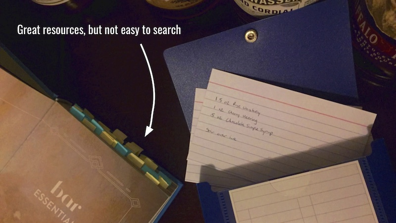
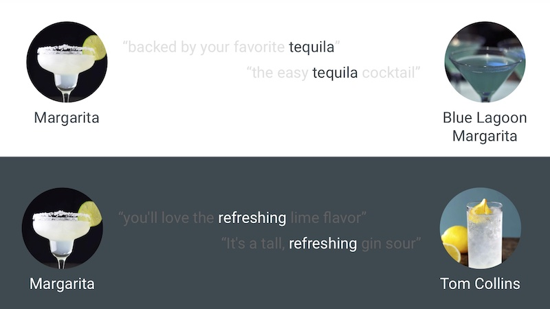

# Boozehound Cocktail Recommendation App

[Try out Boozehound on Heroku!](https://lw-boozehound.herokuapp.com/)

This project was a labor of love for me since it combines two of my favorite things: data and cocktails. Ever since my wife signed us up for a drink-mixing class a few years ago I've been stirring up various concoctions, both established recipes and original creations. My goal was to create a simple app that would let anyone discover new drink recipes based upon their current favorites or just some descriptive words. Recipe books can be fantastic resources, but I often just want something that tastes like *some other drink but different* or *some combination of flavors and a specific spirit* and that's where a table of contents fails. While I never thought of Boozehound as a replacement for my favorite recipe books I was hoping it could serve as an effective alternative when I just don't have the patience to thumb through dozens of recipes to find what I want to make.

### Data Collection

Because I wanted Boozehound to work with descriptions and not just cocktail and spirit names I knew I would be relying upon **Natural Language Processing** and would need a fair amount of descriptive text with which to work. I also wanted the app to look good so I needed to get my recipes from a resource that also has images for each drink. I started by scraping the well-designed [Liquor.com](https://www.liquor.com), which has a ton of great recipes and excellent photos. Unfortunately the site has extremely inconsistent write-ups on each cocktail: some are paragraphs long and others only a sentence or two. I wanted consistent, longer drink descriptions and I found them at [The Spruce Eats](https://www.thespruceeats.com), which I scraped using [a notebook called 'scrape_spruce_eats'](work/scrape_spruce_eats.ipynb). Spruce Eats doesn't have the greatest list of recipes, but I was still able to collect roughly **980** separate drink entries from the site, each with an ingredient list, description, and an image URL.

### Text Pre-Processing

After getting all of my cocktail recipe data into a Pandas DataFrame, I still needed to format my corpus to prepare it for modeling. I used the **SpaCy** library to lemmatize words and keep only the nouns and adjectives. **SpaCy** is both fast and easy to use, which made it ideal for my relatively simple pre-processing. I then used **scikit-learn's TF-IDF implementation** to create a matrix of each recipe's word frequency vector. I chose **TF-IDF** over other vectorizers because it accounts for word count disparities and some of my drink descriptions are twice as long as others. The app also runs user search strings through the same process and those should certainly be shorter than any cocktail description. My pre-processing and modeling work is stored in [a notebook called 'model_spruce_eats'](work/model_spruce_eats.ipynb).

### Models

Building my initial model was a fairly simple process of dimension reduction and distance calculations. Since I had a **TF-IDF** matrix with significantly more columns than rows, I needed some way of condensing those features. I tried a few solutions and **Non-Negative Matrix Factorization** gave me the most sensible groupings. From there I just calculated pairwise Euclidean distances between the **NMF** description vectors and a similarly vectorized search string. There was just one problem: my model was such a good recommender that it was way too boring. It relied far too heavily on the frequency of cocktail and spirit names in determining similarity, so a search for *margarita* would just return ten different variations of margaritas. To make my model more interesting I created a second model that is only able to use words from the description that are not the names of drinks or spirits. Both models are then blended together, which the user can control through the Safe-Weird slider in the Boozehound app.

The image below gives an example of how both models work. Drink and spirit names dominate the descriptions, so the **Safe** model in the top half has a good chance of connecting words like *tequila*. The **Weird** model on the bottom has to make connections using other words, in this case *refreshing*. Because it has less data with which to work, the Weird model tends to make less relevant recommendations, but they’re often more interesting.

### The App

[Boozehound is up and running on Heroku](https://lw-boozehound.herokuapp.com/): feel free to give it a try. I built the app in **Flask** and wanted a simple, clean aesthetic reminiscent of a classy cocktail bar. As a result I spent just as much time using **CSS** to stylize content as I did just getting the app to work properly. Luckily I enjoy design and layout so it was a real pleasure seeing everything slowly come together. My Metis instructors would often bring up the idea of *completing the story* and to me this project would have been incomplete without a concise and visually-pleasing presentation of recipe recommendations.

### Conclusions

While I am pleased with the final product I presented in class at Metis, there's a lot I still want to address with the Boozehound app. Some of the searches I tested returned odd results that could be improved upon. I'd also like to add some UX improvements like helpful feature descriptions and some initial search suggestions for users who don't know what they want. Another planned feature is a one-click search button to allow the user to find recipes similar to a drink that shows up as a recommendation without having to type it into the search bar. Boozehound is all about exploration and I want to make rifling through a bunch of new recipes as easy as possible.
